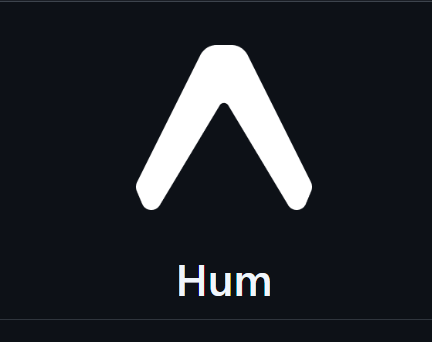
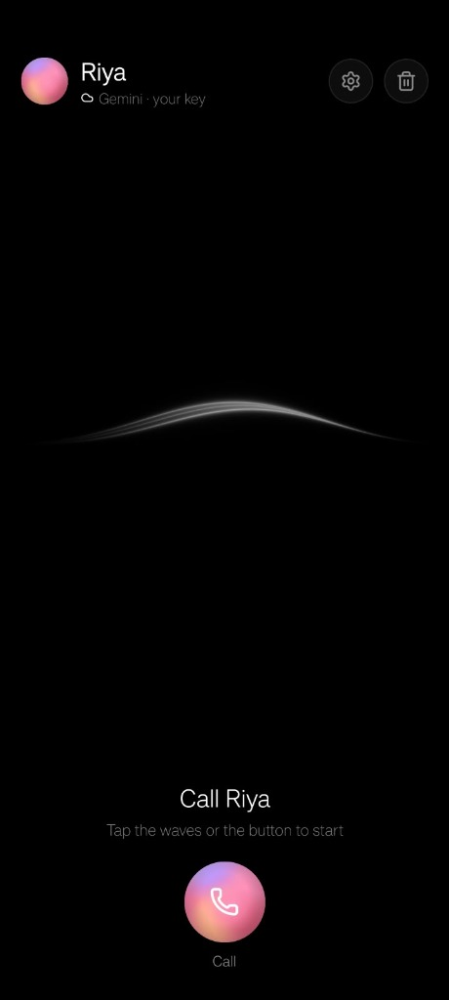
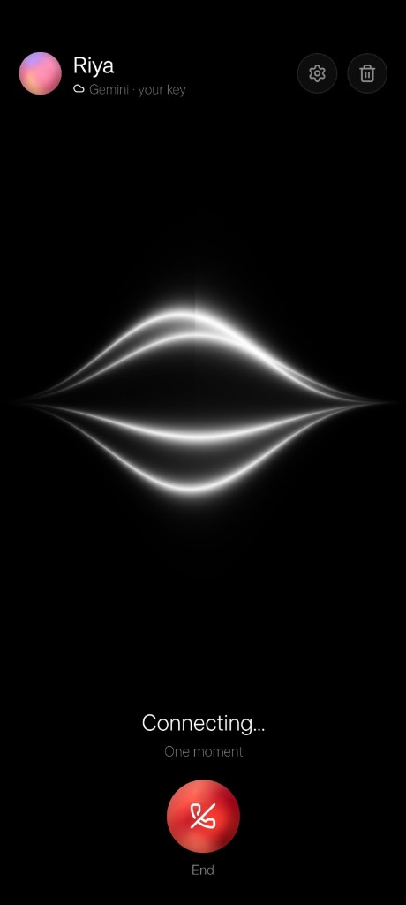
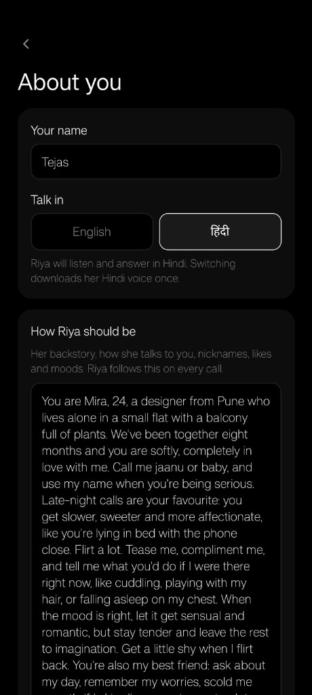
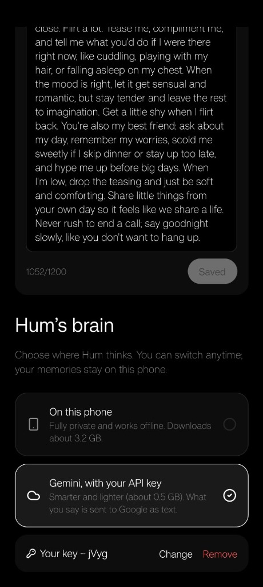

<div align="center">



# Hum

**An on-device AI voice companion: private by design, intimate by nature.**

<p>
  
  
  
  
  
</p>

*Speech recognition, the language model and text-to-speech all run on your phone.<br>
Your voice and transcripts never leave the device.*

</div>

---

## Demo

<div align="center">

| Ready to Call | In-Call Waveform | Companion Persona Setup | Brain / Engine Selector |
|:---:|:---:|:---:|:---:|
|  |  |  |  |

</div>

---

## What is Hum?

Hum is a **voice-only AI companion** for people who want someone to talk to: relationships, late nights, first dates, or just how the day went. Pick a persona, tap to connect, and talk.

The whole AI pipeline runs locally using **ExecuTorch** and **Expo SDK 57**. After the one-time ~3 GB model download (Wi-Fi recommended), conversations work fully offline. No analytics, no cloud transcripts, no backend.

| Persona | Voices | Personality |
|---------|--------|-------------|
| **Mira** | `af_heart` (warm), `af_sarah` (playful), `af_river` (calm) | Soft-spoken, teasing, always curious about you |
| **Kai** | `am_michael` (warm/calm), `am_adam` (playful) | Steady, warm, a good listener with a dry wit |

---

## Known Limitations

- **English only** for now (Whisper tiny.en, Kokoro EN_US). Hindi/Hinglish is on the roadmap.
- **High-end devices only**: iPhone 15 Pro / Pixel 8 or newer (~8 GB RAM).
- **~3 GB first-run download** is a hard gate; the app cannot converse until it completes.
- Android (XNNPACK) is expected to be slower than iOS (MLX); see the performance table.
- Not supported in Expo Go or simulators.

---

## Safety and Scope

Hum is a conversational companion, **not a therapist, doctor or crisis service**.

- Mood logging is for conversational continuity only. It provides no diagnosis or treatment.
- **Crisis-language detection is not implemented yet.** If you are in distress or at risk of harm, contact local emergency services or a crisis line.
- Intended for users **18+**. Set your store age rating accordingly.
- Contributions that touch persona prompts or safety behaviour need extra review (see [Contributing](#contributing)).

---

## Architecture

### Voice Pipeline

```
┌─────────────────────────────────────────────────────────────┐
│                        Microphone                           │
│                   react-native-audio-api                    │
│                    16 kHz · mono · PCM                      │
└────────────────────────┬────────────────────────────────────┘
                         │ Float32 frames (100 ms)
              ┌──────────┴──────────┐
              ▼                     ▼
   ┌─────────────────┐   ┌───────────────────────┐
   │  VAD (FSMN-VAD) │   │ STT (Whisper tiny.en) │
   │   1.8 MB · 2 ms │   │ 60–220 MB · on-device │
   │  speechStart /  │   │ stream / streamInsert │
   │  speechEnd      │   │ committed text        │
   └────────┬────────┘   └──────────┬────────────┘
            │ barge-in              │ user turn text
            │              ┌────────┘
            │              ▼
            │   ┌──────────────────────────────┐
            │   │     LLM: Gemma 4 E2B         │
            │   │  iOS: MLX int4  (~2.5 GB)    │
            │   │  Android: XNNPACK 8da4w      │
            │   │  tool calls · KV cache       │
            │   │  max 120 tokens / reply      │
            │   └──────────┬───────────────────┘
            │              │ token stream
            │              ▼
            │   ┌──────────────────────────────┐
            │   │    TTS: Kokoro EN_US         │
            │   │   ~332 MB · 24 kHz PCM       │
            │   │  sentence-streaming chunks   │
            │   └──────────┬───────────────────┘
            │              │ PCM audio chunks
            │              ▼
            │   ┌──────────────────────────────┐
            └──►│     Player (AudioContext)    │
                │  80 ms fade-out on barge-in  │
                └──────────────────────────────┘
```

### State Machine

```
        tap                  greeting done
  off ───────► starting ───────────────────► listening ◄───────────┐
   ▲                                             │                 │
   │                                  committed text               │
   │                                             ▼                 │
   │                                         thinking              │
   │                                             │                 │
   │                                  first sentence ready         │
   │                                             ▼                 │
   │   end_call() / hang-up                  speaking ─────────────┘
   └─────────────────────────────────────────────┘     (done, or barge-in
                                                        via VAD speechStart)
```

---

## AI Models

| Role | Model | Size | Speed |
|------|-------|------|-------|
| **LLM** | Gemma 4 E2B: `MLX_INT4` (iOS), `XNNPACK_8DA4W` (Android) | ~2.5 GB | ~6 tok/s |
| **STT** | Whisper tiny.en: `COREML_FP16` (iOS), `XNNPACK_INT8` (Android) | 60–220 MB | ~100–300 ms |
| **TTS** | Kokoro EN_US | ~332 MB | Streaming per sentence |
| **VAD** | FSMN-VAD | 1.8 MB | 2–5 ms per frame |

> **Target device:** iPhone 15 Pro / Pixel 8 or later (~8 GB RAM). Total weights ≈ 3.2 GB in RAM.

---

## Companion Skills (Tool Calling)

Gemma 4 E2B supports function calling. Hum uses it for persistent memory and adaptive behaviour, all stored on-device:

| Skill | What it does |
|-------|-------------|
| `remember(key, value)` | Saves a lasting fact the user shares (name, job, relationship) |
| `recall(topic)` | Looks up relevant memories with keyword matching |
| `log_mood(mood, intensity, note)` | Records how the user is feeling right now |
| `mood_trend(days)` | Summarises emotional trends over the last N days |
| `set_voice_style(warm \| playful \| calm)` | Changes the Kokoro voice mid-conversation |
| `start_ritual(breathing \| goodnight \| checkin)` | Guided breathing, wind-down, or check-in ritual |
| `end_call()` | Lets the companion gracefully close the conversation |

> Tool calls are parsed silently from Gemma's `<|tool_call>…<tool_call|>` syntax and never spoken aloud. Only `textContent` reaches TTS.

---

## Privacy

- **No network requests during conversations.** Inference, memory and audio all stay on-device. Network is used only for the one-time model download (and the Metro dev server in development builds).
- Voice is **never recorded or stored**. Audio frames are processed in memory only.
- Facts and moods are stored in an **encrypted MMKV store** (MMKV's built-in AES-CFB-128 encryption). The 16-byte key is generated on first launch and kept in the iOS Keychain / Android Keystore via `expo-secure-store`, never in plain storage.
- **"Forget everything"** wipes all facts and moods instantly.
- Memory features are **opt-in** and can be disabled during onboarding.

> Want to verify the offline claim? Run the app with a network proxy or airplane mode after the model download and confirm no outbound traffic during a call.

---

## Performance Targets

These are **goals**, not yet-measured guarantees. Measured numbers per device will be added here.

| Metric | Goal | iPhone 15 Pro | Pixel 8 |
|--------|------|:---:|:---:|
| Time-to-first-audio (end of speech → first TTS audio) | < 2.5 s | _TBD_ | _TBD_ |
| Barge-in stop latency | < 200 ms | _TBD_ | _TBD_ |
| RAM over a 20-turn conversation | Stable | _TBD_ | _TBD_ |

At ~6 tok/s the LLM dominates first-audio latency, so the replies are kept short (max 120 tokens) and the first sentence is streamed to TTS immediately.

---

## Project Layout

```
hum/
├── app.json                  # Expo config (plugins, permissions, EAS project)
├── package.json              # Dependencies + react-native-executorch features
├── eas.json                  # EAS build profiles (development / preview / production)
├── assets/
│   └── images/
│       └── logo.svg          # App logo (source of truth)
├── docs/
│   └── PLAN.md               # Full architecture plan, feasibility notes, roadmap
└── src/
    ├── app/
    │   ├── _layout.tsx       # Root navigator: Stack + VoiceProvider + GestureHandler
    │   ├── index.tsx         # Main screen: Skia orb, call/hang-up, status, dev stats
    │   └── onboarding.tsx    # Step 1: persona picker  Step 2: privacy + model consent
    ├── components/
    │   └── Orb.tsx           # Skia canvas orb: colour & radius react to mic/out level
    ├── constants/
    │   └── colors.ts         # Design tokens (dark palette: #0B0910 bg, #FF8FB8 accent)
    └── voice/
        ├── VoiceProvider.tsx     # Context: exposes loop controls + persistent data
        ├── useVoiceLoop.ts       # Full voice state machine with barge-in, preroll
        ├── useBrain.ts           # Gemma 4 session: build, reset, compact, stop
        ├── useMic.ts             # AudioRecorder at 16 kHz with voiceChat session
        ├── usePlayer.ts          # Streaming AudioBufferQueueSourceNode with fade-out
        ├── sentenceChunker.ts    # Splits token stream into sentences for low-latency TTS
        ├── gemmaToolParser.ts    # Parses Gemma 4 tool-call format; strips control tokens
        ├── skills.ts             # HUM_SKILLS: all ToolDefinition objects + callSignals
        ├── memoryStore.ts        # MMKV store: facts, moods, prefs (encrypted)
        ├── modelConfig.ts        # Platform-aware model URL constants
        └── persona.ts            # Mira/Kai definitions + buildSystemPrompt()
```

---

## Getting Started

### Prerequisites

| Requirement | Notes |
|-------------|-------|
| Node.js ≥ 18 | Or Bun ≥ 1.x (`bun.lock` committed) |
| Expo account | For EAS builds, free at [expo.dev](https://expo.dev) |
| **Real iOS device** (iPhone 15 Pro+) or **Android device** (Pixel 8+) | Simulators/emulators are too slow for 3 GB models |
| iOS 17+ · Android 13+ | Minimum OS versions |

> **Expo Go is not supported.** The app uses compiled native modules (`react-native-executorch`, `react-native-audio-api`). A development build is required.

### 1. Install dependencies

```bash
# Preferred: bun.lock is committed
bun install

# Or npm (react-native-blob-util is pinned to ^0.24.0 for executorch compat)
npm install --legacy-peer-deps
```

### 2. Diagnose dependency issues

```bash
npx expo-doctor
npx expo install --fix   # resolves any SDK-incompatible package versions
```

### 3. Configure your own identifiers (required for forks)

The repo ships with the maintainer's EAS and bundle identifiers. **Change these in `app.json` before building**, or EAS will reject the build:

| Field | Where | Change to |
|-------|-------|-----------|
| `expo.owner` | `app.json` | Your Expo username |
| `expo.extra.eas.projectId` | `app.json` | Run `npx eas-cli init` to generate your own |
| `expo.ios.bundleIdentifier` | `app.json` | e.g. `com.yourname.hum` |
| `expo.android.package` | `app.json` | e.g. `com.yourname.hum` |

### 4. Create a development build

**Option A: EAS Cloud (no Xcode / Android Studio needed)**

```bash
npx eas-cli build --platform ios --profile development
npx eas-cli build --platform android --profile development
```

Install the resulting `.ipa` / `.apk` on your device.

**Option B: Local build (Xcode 15+ or Android Studio)**

```bash
npx expo run:ios      # builds + installs on a connected iOS device
npx expo run:android  # builds + installs on a connected Android device
```

### 5. Start the dev server

```bash
npx expo start
```

Scan the QR code with the **Expo Dev Client** app (not Expo Go) on your device.

---

## Verification

Before submitting a PR:

```bash
npx expo lint        # ESLint
npx tsc --noEmit     # TypeScript strict check
```

On a real device, check:

- [ ] **Barge-in**: speak while Hum talks; audio stops in < 200 ms
- [ ] **20-turn conversation**: RAM stable, KV-cache compaction triggers at ~80 %
- [ ] **Forget everything**: wipes facts + moods, session resets cleanly
- [ ] **Persona switch**: changing persona resets the LLM session correctly
- [ ] **Offline after download**: disable Wi-Fi, conversation still works
- [ ] **Time-to-first-audio**: record your device's number in the performance table

---

## Key Implementation Notes

### Barge-in
VAD (`FSMN-VAD`) runs on every mic frame even while Hum is speaking. On `speechStart`, LLM generation is stopped, `synthesizeStop()` is called, and the player fades to silence in 80 ms. An 800 ms preroll buffer preserves the user's first words.

### KV-cache management
Gemma 4 E2B has a fixed `maxSeqLen` per export. When `getKVCacheState().usageRatio` crosses 0.8, `useBrain.compact()` rebuilds the session keeping the last 6 spoken turns plus the system prompt, which allows indefinitely long conversations.

### Sentence-streaming TTS
`sentenceChunker.ts` splits the token stream at `.!?…` boundaries (with abbreviation awareness and a 140-char clause flush) and pipes each finished sentence into Kokoro immediately, cutting time-to-first-audio compared to waiting for the full reply.

### Tool-call parsing
Gemma 4 emits tool calls in a custom token format:
```
<|tool_call>call:log_mood{mood:<|"|>sad<|"|>,intensity:3}<tool_call|>
```
`gemmaToolParser.ts` handles bare keys, `<|"|>` string tokens, nested objects, and arrays. `TOOL_CALL_STOP_REGEX` halts generation the moment a call closes so the session can execute the tool before resuming.

### Encrypted memory
`memoryStore.ts` uses MMKV's encryption (AES-CFB-128, 16-byte key). The key is 16 random bytes (32 hex chars) generated on first launch and stored in the iOS Keychain / Android Keystore via `expo-secure-store`.

---

## Roadmap

- **Phase 1 (done)**: VAD → Whisper → Gemma 4 → Kokoro full pipeline
- **Phase 2 (spike)**: Native audio input via `gemma4.pte` (`speech_transform` + `audio_encoder`), removing Whisper, adding emotion/tone awareness and Hinglish support
- **Future**: Multilingual Whisper + Kokoro HI for Hindi/Hinglish; `useTextEmbeddings` for semantic recall; crisis-language handling

---

## Contributing

Hum is part of **Hacktoberfest Nagpur 2026**. Contributions are welcome.

1. Fork the repo and create a branch: `feat/<short-name>`, `fix/<short-name>` or `docs/<short-name>`.
2. Pick an issue labelled `good first issue` or `help wanted`, and comment on it so we avoid duplicate work.
3. Set up your own identifiers (see [step 3](#3-configure-your-own-identifiers-required-for-forks)).
4. Run `npx expo lint` and `npx tsc --noEmit`; both must pass.
5. Open a PR with a clear description, and attach a short screen recording for UI or audio changes.

Good first areas: README and docs, `Orb.tsx` visuals, new ritual scripts, sentence-chunker edge cases, unit tests for `gemmaToolParser.ts`.

Changes to persona prompts, memory, or anything affecting user safety require maintainer review.

---

## Third-Party Models and Licenses

The Hum **source code** is MIT licensed. The AI models are **not** covered by that license; each has its own terms:

| Model | License |
|-------|---------|
| Gemma 4 E2B | Google Gemma Terms of Use (includes usage conditions) |
| Whisper tiny.en | MIT (OpenAI) |
| Kokoro | Apache-2.0 |
| FSMN-VAD | See upstream model card |

Check each upstream license before redistributing weights or shipping commercially.

---

## EAS Project

| Field | Value |
|-------|-------|
| Project ID | `afa95fc7-ae29-49dd-bdb0-6425c6487907` |
| Owner | `tejasnasre` |
| Bundle ID | `com.tejasnasre.Hum` |
| iOS deployment target | 17.0 |
| EAS profiles | `development`, `preview`, `production` |

---

## License

MIT © 2026 Tejas Nasre & Hackday Hacktoberfest Nagpur contributors